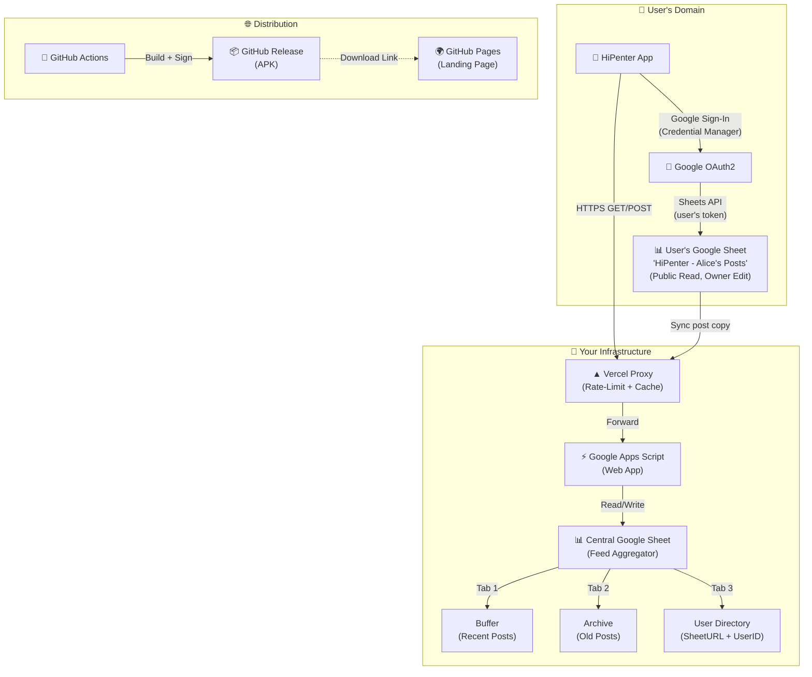
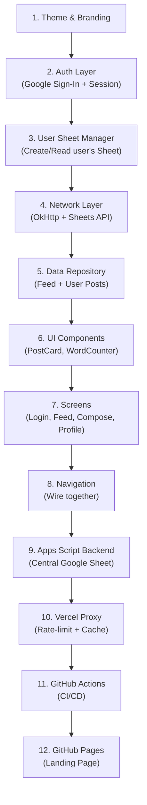

# HiPenter — Revised Implementation Plan

A decentralized social posting app where users own their data in their personal Google Sheet. Everyone can read, only you can edit yours.

---

## Architecture Overview



### How It Works — The Data Flow

**When a user posts:**
1. App writes the post to the **user's own Google Sheet** (via Google Sheets API + user's OAuth token) — user owns this data forever
2. App also sends a copy to the **Vercel proxy** → Apps Script → **Central Google Sheet** "Buffer" tab — this powers the public feed
3. The user's Sheet URL is registered in the "User Directory" tab (one-time on first login)

**When a user reads the feed:**
1. App calls Vercel proxy → reads from Central Google Sheet "Buffer" tab
2. Vercel caches responses (60s TTL) to save Google API quota
3. Rate-limited to prevent DoS

**When a user deletes their post:**
1. App deletes from user's own Sheet
2. App sends delete request to Vercel → removes from Central Sheet

**Data ownership:** Users can always access/export/delete their data from their own Google Sheet. If they delete the sheet, posts are gone from central feed on next sync.

---

## What Gets Saved Where

| Data | Location | Why |
|------|----------|-----|
| User's posts (source of truth) | **User's Google Sheet** | User owns and controls their data |
| Post copies (for feed) | **Central Google Sheet** | Fast feed loading, no need to read N sheets |
| User directory (userId → sheetURL) | **Central Google Sheet tab** | Know where to find each user's data |
| Abuse reports | **Central Google Sheet tab** | Moderation |
| Rate-limit state | **Vercel WAF** (built-in) | DoS prevention, nothing to store |
| API request logs | **Vercel function logs** | Debug, auto-expires |
| App version telemetry | **Nothing** | Keep Vercel stateless as you want |

---

## Proposed Changes

### 1. Google Apps Script Backend

#### [NEW] `backend/appsscript/Code.gs`

Google Apps Script deployed as Web App:

| Endpoint | Method | Description |
|----------|--------|-------------|
| `/exec?action=feed&page=0` | GET | Returns latest 50 posts from "Buffer" tab |
| `/exec` | POST `{action:"post", content, author, userSheetUrl}` | Writes post to Buffer + registers user in Directory |
| `/exec` | POST `{action:"delete", postId, userId}` | Removes post from Buffer |
| `/exec` | POST `{action:"register", userId, sheetUrl, displayName}` | One-time user registration |

**Time-based triggers:**
- Every hour: move posts older than 7 days from "Buffer" → "Archive"
- Daily: cleanup orphaned entries

#### [NEW] `backend/appsscript/setup-instructions.md`

Step-by-step setup guide for the Google Sheet + Apps Script deployment.

---

### 2. Vercel Proxy (DoS Protection)

#### [NEW] `backend/vercel/api/feed.ts`

GET endpoint — proxies feed requests to Apps Script. Adds:
- **Vercel WAF rate-limiting**: 30 requests/minute per IP
- **Response caching**: 60-second TTL (reduces Apps Script quota usage dramatically)
- Hides the real Apps Script URL from the client

#### [NEW] `backend/vercel/api/post.ts`

POST endpoint — proxies post submissions. Adds:
- **Rate-limiting**: 5 posts/minute per IP (stricter)
- Content validation (15 word max, no scripts)
- Forwards authenticated userId for ownership tracking

#### [NEW] `backend/vercel/api/delete.ts`

POST endpoint — proxies delete requests with rate-limiting.

#### [NEW] `backend/vercel/package.json`
#### [NEW] `backend/vercel/vercel.json`

Vercel config with WAF rules, rewrites, and environment variables.

---

### 3. Authentication (Google Sign-In + Persistent Session)

#### [NEW] `app/src/main/java/com/example/hipenter/auth/GoogleAuthManager.kt`

Handles the full auth lifecycle:
- **Sign-In**: Uses Credential Manager API (modern, recommended)
- **Persistent Login**: Stores OAuth refresh token in `EncryptedSharedPreferences` → user stays logged in until explicit logout
- **Auto Sign-In**: On app launch, checks for saved credentials and silently restores the session
- **Scopes**: `https://www.googleapis.com/auth/spreadsheets` + `https://www.googleapis.com/auth/drive.file`
- **Token Refresh**: Automatic background refresh of access tokens via OkHttp interceptor

#### [NEW] `app/src/main/java/com/example/hipenter/auth/UserSession.kt`

Data class holding user state:
```
UserSession(
  userId: String,        // Google account ID
  email: String,
  displayName: String,
  profilePhotoUrl: String?,
  accessToken: String,   // Short-lived, auto-refreshed
  refreshToken: String,  // Long-lived, stored encrypted
  personalSheetId: String? // Created on first login
)
```

#### [NEW] `app/src/main/java/com/example/hipenter/ui/auth/LoginScreen.kt`

Beautiful login screen with:
- App logo + tagline
- "Sign in with Google" button (Material 3 style)
- Brief explanation: "Your posts are saved in YOUR Google Sheet"
- Privacy-first messaging

---

### 4. User's Personal Google Sheet Management

#### [NEW] `app/src/main/java/com/example/hipenter/sheets/UserSheetManager.kt`

On first login, automatically:
1. Creates a Google Sheet in user's Drive: **"HiPenter — [Name]'s Posts"**
2. Sets sharing to **"Anyone with the link can view"** (public read)
3. Creates headers: `PostID | Content | Timestamp | Status`
4. Registers the sheet URL in the central directory (via Vercel proxy)
5. Caches the sheetId locally

On each post:
- Appends a row to the user's personal sheet
- Also sends to central feed via Vercel

On delete:
- Removes the row from user's sheet
- Sends delete to central feed

---

### 5. Network Layer

#### [NEW] `app/src/main/java/com/example/hipenter/network/HiPenterApi.kt`

Two API clients in one:
1. **Feed API** — calls Vercel proxy (OkHttp, simple REST)
2. **Sheets API** — calls Google Sheets API directly (user's own sheet, uses user's OAuth token)

#### [NEW] `app/src/main/java/com/example/hipenter/network/AuthInterceptor.kt`

OkHttp interceptor that:
- Attaches access token to requests
- Auto-refreshes expired tokens using stored refresh token
- If refresh fails → prompts re-login

#### [NEW] `app/src/main/java/com/example/hipenter/network/models/Post.kt`

```kotlin
@Serializable
data class Post(
    val id: String,
    val content: String,
    val author: String,
    val authorPhotoUrl: String? = null,
    val userSheetUrl: String? = null,  // Link to user's public sheet
    val timestamp: Long,
)
```

---

### 6. Data Layer

#### [MODIFY] [DataRepository.kt](file:///c:/Users/user/Desktop/HiPenter/app/src/main/java/com/example/hipenter/data/DataRepository.kt)

Complete rewrite:
- `getFeed(): Flow<List<Post>>` — from Vercel proxy (central feed)
- `submitPost(content: String)` — writes to user's sheet + central feed
- `deletePost(postId: String)` — removes from both
- `getMyPosts(): Flow<List<Post>>` — reads from user's personal sheet
- In-memory + SharedPreferences cache for offline access

#### [NEW] `app/src/main/java/com/example/hipenter/data/LocalCache.kt`

SharedPreferences-based cache so the feed loads instantly on app open.

---

### 7. UI Screens (Jetpack Compose)

#### [MODIFY] [MainScreen.kt](file:///c:/Users/user/Desktop/HiPenter/app/src/main/java/com/example/hipenter/ui/main/MainScreen.kt)

Complete redesign → **Feed Screen**:
- Pull-to-refresh post list
- Each post card shows: content, author name + photo, relative time, link to author's sheet
- FAB button to compose new post
- Top app bar with profile avatar + settings

#### [MODIFY] [MainScreenViewModel.kt](file:///c:/Users/user/Desktop/HiPenter/app/src/main/java/com/example/hipenter/ui/main/MainScreenViewModel.kt)

Real data loading, pull-to-refresh, error handling.

#### [NEW] `app/src/main/java/com/example/hipenter/ui/compose/ComposePostScreen.kt`

Post composer (bottom sheet):
- Text field with **live word counter** (0/15, turns red at limit)
- Character animation when approaching limit
- "Post" button with loading state
- Success confetti animation

#### [NEW] `app/src/main/java/com/example/hipenter/ui/profile/ProfileScreen.kt`

User's profile showing:
- Their Google profile info
- Link to their personal Google Sheet ("View your data")
- List of their posts with delete option
- Logout button

#### [NEW] `app/src/main/java/com/example/hipenter/ui/components/PostCard.kt`

Reusable post card with Material 3 styling, gradient accent, subtle elevation animation.

#### [NEW] `app/src/main/java/com/example/hipenter/ui/components/WordCounter.kt`

Animated circular word counter widget.

---

### 8. Theme & Branding

#### [MODIFY] [Color.kt](file:///c:/Users/user/Desktop/HiPenter/app/src/main/java/com/example/hipenter/theme/Color.kt)

Custom HiPenter palette:
- Primary: Vibrant teal `#00BFA6`
- Secondary: Soft coral `#FF6B6B`
- Surface Dark: Navy `#1A1B2E`
- Card gradients for visual depth

#### [MODIFY] [Type.kt](file:///c:/Users/user/Desktop/HiPenter/app/src/main/java/com/example/hipenter/theme/Type.kt)

Google Fonts: **Inter** (body) + **Outfit** (headings), bundled in assets.

#### [MODIFY] [Theme.kt](file:///c:/Users/user/Desktop/HiPenter/app/src/main/java/com/example/hipenter/theme/Theme.kt)

Custom color scheme + typography applied.

---

### 9. Navigation

#### [MODIFY] [NavigationKeys.kt](file:///c:/Users/user/Desktop/HiPenter/app/src/main/java/com/example/hipenter/NavigationKeys.kt)

Add keys: `Login`, `Feed`, `ComposePost`, `Profile`

#### [MODIFY] [Navigation.kt](file:///c:/Users/user/Desktop/HiPenter/app/src/main/java/com/example/hipenter/Navigation.kt)

Route to Login (if not authenticated) or Feed (if signed in). Add all screen routes.

---

### 10. Build & Release

#### [MODIFY] [app/build.gradle.kts](file:///c:/Users/user/Desktop/HiPenter/app/build.gradle.kts)

- Enable `buildConfig = true` (inject Vercel URL)
- Add signing config from environment variables
- Add Google Sheets API + Credential Manager + OkHttp dependencies

#### [MODIFY] [libs.versions.toml](file:///c:/Users/user/Desktop/HiPenter/gradle/libs.versions.toml)

Add dependencies:
- `com.google.android.libraries.identity.googleid` (Credential Manager Google provider)
- `androidx.credentials:credentials` (Credential Manager)
- `com.google.apis:google-api-services-sheets` (Google Sheets API)
- `com.google.api-client:google-api-client-android` (API client)
- `com.squareup.okhttp3:okhttp` (HTTP)
- `org.jetbrains.kotlinx:kotlinx-serialization-json` (JSON)
- `androidx.security:security-crypto` (EncryptedSharedPreferences)
- `io.coil-kt:coil-compose` (Profile photo loading)

#### [MODIFY] [AndroidManifest.xml](file:///c:/Users/user/Desktop/HiPenter/app/src/main/AndroidManifest.xml)

Add `<uses-permission android:name="android.permission.INTERNET" />`

#### [NEW] `.github/workflows/release.yml`

GitHub Actions: tag push → build → sign → create GitHub Release with APK.

#### [NEW] `.github/workflows/build.yml`

PR CI: build + test + lint.

---

### 11. GitHub Pages Landing Page

#### [NEW] `docs/index.html`

Beautiful landing page (deployed to GitHub Pages from `/docs`):
- App name, logo, tagline: *"Your words, your data."*
- Feature highlights (data ownership, privacy, open-source)
- **Download APK** button (links to latest GitHub Release)
- Screenshots/mockups
- Link to GitHub repo

#### [NEW] `docs/style.css`

Premium dark-themed landing page with gradients and animations.

---

## Implementation Order



---

## Google Cloud Console Setup Required

> [!IMPORTANT]
> Before the app can work, you'll need to set up a Google Cloud project. I'll provide a step-by-step guide, but here's what's needed:
> 1. Create a project at [console.cloud.google.com](https://console.cloud.google.com)
> 2. Enable **Google Sheets API** and **Google Drive API**
> 3. Configure OAuth consent screen (External, app name "HiPenter")
> 4. Create credentials: **Android Client ID** (needs your SHA-1 fingerprint) + **Web Client ID**
> 5. Add scopes: `spreadsheets`, `drive.file`

---

## Verification Plan

### Automated Tests
```bash
./gradlew assembleDebug    # Build check
./gradlew test             # Unit tests
./gradlew lint             # Lint
```

### Manual Verification
- Sign in with Google → verify Sheet is created in user's Drive
- Post a message → verify it appears in user's Sheet AND central feed
- Read feed → verify posts from other users appear
- Delete post → verify removed from both sheets
- Kill app → reopen → verify still logged in (persistent session)
- Test Vercel rate-limiting with rapid requests
- Test GitHub Actions release with a test tag
- Verify GitHub Pages landing page renders correctly
